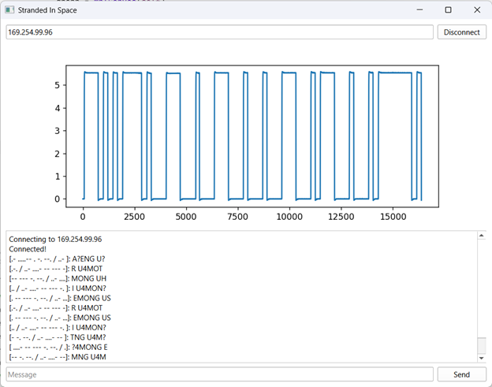

# Red Pitaya Hackathon 2023

Written for the 2023 Red Pitaya Hackathon @ UCSD, "Stranded in Space."

This program connects to a [Red Pitaya](https://redpitaya.com/) via SCPI and instructs it to decode an infrared signal.
The signal is displayed in the GUI as a waveform, decoded into Morse code, and then translated into English.

The program is made up of the following:
- gui.ui / gui.py: a QT Designer based GUI for the program.
- main.py: instantiates our QtPy GUI, and binds it to the daemon.
- daemon.py: Creates a background thread which issues SCPI commands to the Red Pitaya to receive data.
- event.py: Definitions for QtPy events used by the daemon to send data back to the UI.